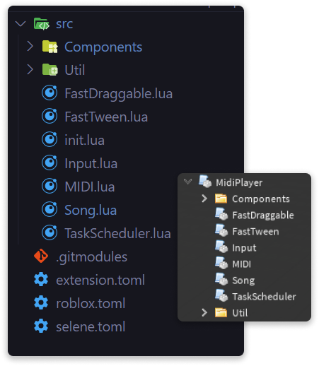

<h1 align="center">Rostruct</h1>
<div align="center">
	<a href="https://github.com/richie0866/Rostruct/actions/workflows/release.yml"></a>
	<a href="https://github.com/richie0866/Rostruct/actions/workflows/eslint.yml"></a>
	<a href="https://github.com/richie0866/Rostruct/releases/latest"></a>
	<a href="https://richie0866.github.io/Rostruct"></a>
</div>

<div align="center">
	A project framework inspired by Rojo.
</div>

---

`Rostruct` is a file execution library built with [roblox-ts](https://roblox-ts.com/) that deploys Lua projects in a Roblox script executor. This library is a substitute for frameworks that use `HttpGetAsync` and `GetObjects` to run code. Rostruct works to bring the modern [Rojo](https://rojo.space/docs/6.x/sync-details/) workflow to exploiting.

Whether you're familiar with Rojo, dislike loading assets during runtime, or want to import libraries, you might enjoy using this library. 

See the original concept [here](https://v3rmillion.net/showthread.php?tid=1081675).

## Why Rostruct?
Script executors run one script at a time. This often leads developers to store large projects in single files. Eventually, using comments to group chunks of code isn't enough, and using internal modules only drives the point home. Cluttered scripts can disrupt workflow and make development difficult overall.

On the other hand, scripting in Roblox Studio allows scripts, modules, and assets to access each other on the fly. You don't have to make an HTTP request to load a dependency or call `GetObjects` to load an asset; you only need to include them in your place file.

Rostruct works to bring the benefits of Roblox Studio to exploiting by transforming your project files into Roblox instances _before_ executing your code. This way, instead of waiting for assets to load, or keeping all your code in one file, you can store them in your project and run it as you would in Studio.

## Documentation
Documentation is available at the [Github pages site](https://richie0866.github.io/Rostruct).

## How it works
How does Rostruct build instances?



* Rostruct builds instances following a [file conversion model](https://richie0866.github.io/Rostruct). Files compatible with Rostruct (`lua`, `json`, `rbxm`, etc.) are converted to Roblox instances.

What does deploying a project do?

* Projects can be deployed or required. If you deployed the project, Rostruct executes every `LocalScript` in the instance tree.
* If you required the project, and the project results in a `ModuleScript` (as seen in the image), it requires the module and stores the result.

Every script has preset `script` and `require` variables to closely mirror a Rojo & Roblox Studio workflow. This way, scripts in your project don't need any extra configuration to require modules and get assets.

## Features
* Promotes modular programming
  * Ensure quality readability, debugging, and maintainability in your projects.
* Instance-based execution
  * Run your projects in an environment that closely mirrors a Rojo & Roblox Studio workflow.
* Github support
  * Install and deploy projects directly from Github releases, allowing users to execute your code without manually downloading it.
* Builds `rbxm` models
  * Go `GetObjects`-free by loading models directly from your project files.
* Designed with [Rojo](https://github.com/rojo-rbx/rojo#readme) in mind
  * Easily test your code in Roblox Studio before executing it.

What's on the roadmap?
* Project configuration file
  * Using configuration files can help customize the structure of your project. You decide where to build your files, and Rostruct handles it for you. 
* Fully implement [`init.meta.json`](https://rojo.space/docs/6.x/sync-details/#meta-files) properties
  * Currently, only primitive types like `boolean` and `number` can be set.

## Installation
### Option 1: Local files
* Download the latest `Rostruct.lua` file from the [Github Releases page](https://github.com/richie0866/Rostruct/releases/latest)
* Locate your executor's `workspace/` directory and insert `Rostruct.lua` into a folder named "rostruct"
* Rostruct is ready to use!
```lua
local Rostruct = loadfile("rostruct/Rostruct.lua")()
local Rostruct = loadstring(readfile("rostruct/Rostruct.lua"))()
```

### Option 2: From releases
* Locate the latest release of Rostruct from the [Github Releases page](https://github.com/richie0866/Rostruct/releases/latest)
* Right-click the `Rostruct.lua` asset and copy the URL (ends with `/releases/download/TAGNAME/Rostruct.lua`)
* Use Rostruct in your code with `game.HttpGetAsync`!
```lua
local Rostruct = loadstring(game:HttpGetAsync(".../releases/download/TAGNAME/Rostruct.lua"))()
```

### Option 3: For your scripts
> Because Rostruct is written in TypeScript, it uses the `TS` module to load. This is black magic that should be taken at face value when viewing the code below.
> `TS.initialize("init")` essentially requires Rostruct straight from the source.
* Make sure your Github repository is public and has a [release](https://docs.github.com/en/github/administering-a-repository/releasing-projects-on-github/managing-releases-in-a-repository) available.
  * Typically, no further action is needed here, unless you want a specific asset released. In that case, bundle it in a zip file if needed.

* Then, save the latest release of `Rostruct.lua` and replace the ending `return` statement with this to load it:
```lua
-- Rostruct source here

local Rostruct = TS.initialize("init")
```
* In your file, use Rostruct to download your latest release, with an optional asset if desired. You can write your code as such:
```lua
-- Rostruct source here

local Rostruct = TS.initialize("init")

-- Download the latest release to local files:
Rostruct.DownloadLatestRelease("REPO_OWNER", "REPO_NAME")
    :andThen(function(download)
	-- Your project may not have an 'src/' folder, but it's recommended
	-- you have one to separate source files from things like
	-- configuration files.
        local project = Rostruct.Deploy(download.Location .. "src/")
        project.Instance.Name = "REPO_NAME"
    end)
```
* Useful examples of Rostruct in the wild can be found [in the documentation](https://richie0866.github.io/Rostruct/scripts-using-rostruct/).
> Finding a way to load the latest Rostruct release automatically is not recommended, as updates can change functionality at any time. Instead, use any of the options, and Watch this repository to be notified of new releases.
