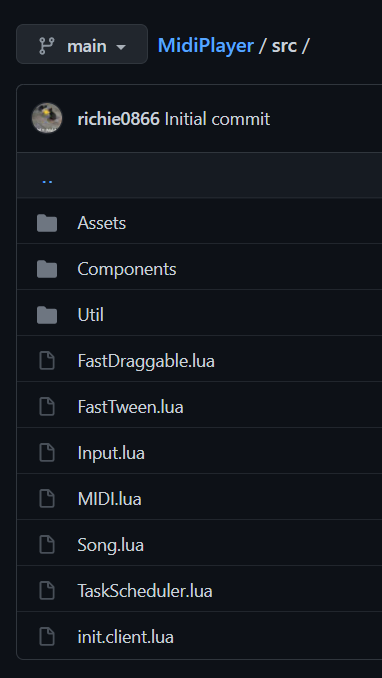

# File conversion

??? example
	
	{ align=middle width=256px }
	-> [`Package.build`](../api-reference/package/methods/../build.md) ->
	{ align=middle width=256px }

???+ danger

	Because Rostruct runs code, and Rojo syncs code to Roblox Studio, some key differences exist in functionality.

	!!! missing "Not supported"

		* Rojo project files
			* Project files structure your codebase around the `game` object, which would expose your project to the client.

	!!! warning "Differences"

		* `.rbxm` and `.rbxmx` files are fully supported, but [the former](https://rojo.space/docs/6.x/sync-details/#models) is buggy in Rojo.

	!!! bug "Known issues"

		* `*.model.json` files do not support Rojo's custom properties like `Instance.Tags` and `LocalizationTable.Content`.
		* `*.meta.json` files infer property types differently than Rojo meta files.

Rostruct file conversion mirrors [Rojo's sync details](https://rojo.space/docs/6.x/sync-details/).

Concepts on the table below will redirect you to their respective Rojo pages.

## Supported Rojo concepts

| Concept                                                                              | File Name        |    Supported     |
| ------------------------------------------------------------------------------------ | ---------------- | :--------------: |
| [Folders](https://rojo.space/docs/6.x/sync-details/#folders)                         | any directory    | :material-check: |
| Server [scripts](https://rojo.space/docs/6.x/sync-details/#scripts)                  | `*.server.lua`   | :material-minus: |
| Client [scripts](https://rojo.space/docs/6.x/sync-details/#scripts)                  | `*.client.lua`   | :material-check: |
| Module [scripts](https://rojo.space/docs/6.x/sync-details/#scripts)                  | `*.lua`          | :material-check: |
| XML [models](https://rojo.space/docs/6.x/sync-details/#models)                       | `*.rbxmx`        | :material-check: |
| Binary [models](https://rojo.space/docs/6.x/sync-details/#models)                    | `*.rbxm`         | :material-check: |
| [Localization tables](https://rojo.space/docs/6.x/sync-details/#localization-tables) | `*.csv`          | :material-check: |
| [Plain text](https://rojo.space/docs/6.x/sync-details/#plain-text)                   | `*.txt`          | :material-check: |
| [JSON modules](https://rojo.space/docs/6.x/sync-details/#json-modules)               | `*.json`         | :material-check: |
| [JSON models](https://rojo.space/docs/6.x/sync-details/#json-models)                 | `*.model.json`   | :material-check: |
| [Projects](https://rojo.space/docs/6.x/sync-details/#projects)                       | `*.project.json` | :material-close: |
| [Meta files](https://rojo.space/docs/6.x/sync-details/#json-modules)                 | `*.meta.json`    | :material-minus: |
