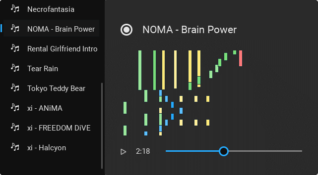

# Featured

To get a better understanding of Rostruct, seeing real-world examples may help.

## How to get featured

If you'd like your script featured here, contact `0866#3049` on Discord, or send a PM to 0866 on V3rmillion :pray_tone4:

## Community

### [MidiPlayer](https://github.com/richie0866/MidiPlayer) <small>by 0866</small>

A midi file auto-player for Roblox piano games.

!!! success "Notable features"

	* UI stored in a `*.rbxm` file
	* A single LocalScript initializes the code
	* Uses common utility modules

!!! example
	
