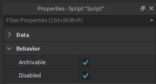

# Creating your project

Rostruct turns Lua projects into Roblox instances to provide an intuitive development environment compatible with Rojo. Keeping this in mind, your files should behave as scripts running in Roblox Studio.

Every Lua script is loaded and executed with a modified global environment, making it almost identical to running a LocalScript or ModuleScript. This includes the ability to require other modules using the `#!lua require()` function as you would in Roblox Studio.

??? example "File conversion example"

	Check out the [file conversion](../reference/file-conversion.md) page for more complete information.

	=== "Source code"

		{ width=256px }

	=== "Rostruct"

		{ width=256px }

To set up a project, locate your executor's `workspace/` directory and create a folder somewhere to host your project. It's recommended to integrate Rojo into your workflow to test your code in Roblox Studio.

## Sync to Roblox as you write

With [Rojo](https://rojo.space/docs/), your project files sync to Roblox Studio in real-time, enabling a smooth development experience.

You can get [Rojo for VS Code](https://marketplace.visualstudio.com/items?itemName=evaera.vscode-rojo), which will install both the Rojo Roblox Studio plugin and the command-line interface.

## Building your project

Once you're done setting up and writing your code, you can deploy your local project with:

=== "Deploy"

	```lua
	local build = Rostruct.Deploy("projects/MyProject/src/")
	```

=== "Require"

	```lua
	local build = Rostruct.Require("projects/MyModule/src/")
	local MyModule = build.Module:expect()
	```

For complete documentation, check out the [API reference](../reference/functions.md).

## Setting build metadata

Some projects need to access the root instance to access other objects:

```lua
local myProject = script:FindFirstAncestor("MyProject")

local Roact = require(myProject.Modules.Roact)

local character = myProject.Assets.Character
```

Typically, in Rojo, the root instance's name can be set in the `project.json` file. However, Rostruct does not support Rojo project files, so how can you achieve this?

You can set build metadata with [meta files](https://rojo.space/docs/6.x/sync-details/#meta-files), a powerful tool from Rojo that tells Rostruct how to create the Instance for a file with the same name. For example, this meta file makes `foo.server.lua` disabled when turning into a script:

!!! info "Rostruct scripts run regardless of the `Disabled` property"

=== "Script.meta.json"

	```json
	{
		"properties": {
			"Disabled": true
		}
	}
	```

=== "Script.server.lua"

	

For a full explanation, see Rojo's page on [meta files](https://rojo.space/docs/6.x/sync-details/#meta-files).
