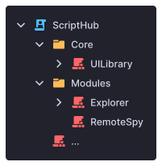

# Getting started

With **Rostruct**, script executors can run your Lua projects as Roblox Instances. Integrate powerful tools like [Rojo](https://rojo.space/docs/) and [Selene for VS Code](https://marketplace.visualstudio.com/items?itemName=Kampfkarren.selene-vscode) into your workflow, ensuring a hassle-free development experience.

This documentation is a work in progress!

## What you need to know

This guide assumes:

- [x] You're familiar with development in an external code editor.
    * If you're unsure of how to manage Roblox projects externally, or what we're trying to accomplish, check out the [Rojo docs](https://rojo.space/) for a detailed explanation.

- [x] You understand how to use Promises.
    * Though the Promise-based API is optional, it's very useful. If you'd like to learn more, check out evaera's [Promise library](https://eryn.io/roblox-lua-promise/). 

## Why Rostruct?

When it comes to exploiting, projects are often developed and maintained within a single file. However, scripts that get too large become detrimental to your workflow. Over time, your project becomes more difficult to debug, maintain, and share.

In contrast, with Rojo, your codebase gets turned directly into Roblox Instances. Taking this modular approach to exploiting can significantly improve the development experience.

Rostruct's design complements a Rojo-based workflow, introducing script developers to a professional way to manage projects.

---

{ align=right width=200 draggable=false }

### Built for ambitious projects

Rostruct executes multiple files at once, so you can focus on making your code readable, without worrying about the implementation.

Create projects from UI libraries to explorers - with little to no limitations.

---

### Asset management

Store all of your UI, modules, and assets locally, and they'll be loaded as Roblox objects before runtime.

Write your code without waiting for assets.

{ align=right width=200 draggable=false }

```lua
local midiPlayer = script:FindFirstAncestor("MidiPlayer")

local Signal = require(midiPlayer.Util.Signal)
local Date = require(midiPlayer.Util.Date)
local Thread = require(midiPlayer.Util.Thread)

local gui = midiPlayer.Assets.ScreenGui

gui.Parent = gethui()
```

---

### Use projects anywhere

Want to use a resource? Load Rostruct projects in your script with an intelligent Promise-based module system.

Seamlessly integrate large projects with an easy-to-use API.

{ align=right width=200 draggable=false }

```lua
local Roact = Rostruct.fetchLatest("Roblox", "roact")
	:andThen(function(package)
		package:build("src/", { Name = "Roact" })
		return package:require(package.tree.Roact)
	end)
	:expect()
```

---

### Take advantage of model files

If you're experienced with GitHub, you can set up a workflow to distribute your project as a `*.rbxm` model file.

Decrease loading times with model files.

{ align=right width=200 draggable=false }

```lua
local Roact = Rostruct.fetchLatest("Roblox", "roact", "Roact.rbxm")
	:andThen(function(package)
		return package:require(
			package:build("Roact.rbxm")
		)
	end)
	:expect()
```

---

{ align=right width=180 draggable=false }

### Test at any time

Design your project with Rojo, a popular tool used to sync an external code editor with Roblox Studio.

Write code, even during exploit downtime.

---

### Recommended tools

Rostruct can (and should!) be paired with helpful tools like:

* [Rojo](https://rojo.space/docs/) - a project management tool
* [Roblox LSP](https://devforum.roblox.com/t/roblox-lsp-full-intellisense-for-roblox-and-luau/717745) - full intellisense for Roblox and Luau in VS Code
* [Selene for VS Code](https://marketplace.visualstudio.com/items?itemName=Kampfkarren.selene-vscode) - a static analysis tool to help you write better Lua
