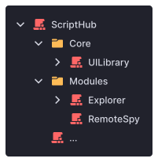
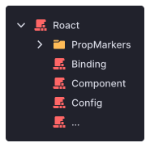

# Getting started

**Rostruct** is a script execution library best used with [Rojo](https://rojo.space/docs/), a tool for syncing project files with Roblox Studio. Rostruct is used to deploy Lua projects to Roblox script executors.

This documentation is a work in progress!

!!! note
	This documentation assumes some familiarity with Rojo. If you're new to development in an external IDE, [Rojo's documentation](https://rojo.space/docs/) provides an in-depth explanation and why you should do it.

## Why Rostruct?

Because of the limitations of script executors, developers are often lead to storing their codebase in a single Lua file. Large, messy files are detrimental to your workflow, as they make debugging, management, and working in teams difficult.

In contrast, if you've ever used Rojo with Roblox Studio, you're able to distribute your codebase between separate, specialized files. Taking a **modular approach** to exploit scripting can significantly improve your workflow.

Rostruct's design complements this Rojo-based workflow, introducing script developers to a professional way to manage projects. You host your project files in your exploit's `workspace/` directory, allowing the integration of professional tools used in Roblox game development into your workflow.

---

{ align=right width=200 draggable=false }

### Built for ambitious projects

Rostruct executes multiple files at once, so you can focus on making your code readable, without worrying about the implementation.

Create projects from UI libraries to explorers - with little to no limitations.

---

### Asset management

Store all of your UI, utilities, and models locally, and they'll be loaded as Roblox objects before runtime.

Write your code without assets slowing down runtime.

{ align=right width=200 draggable=false }

```lua
local midiPlayer = script:FindFirstAncestor("MidiPlayer")

local Signal = require(midiPlayer.Util.Signal)
local Date = require(midiPlayer.Util.Date)
local Thread = require(midiPlayer.Util.Thread)

local gui = midiPlayer.Assets.ScreenGui

gui.Parent = gethui()
```

---

### Load dependencies

Safely integrate external libraries into your projects with an intelligent Promise-based module loading system.

External libraries load like any other ModuleScript.

{ align=right width=200 draggable=false }

```lua
local download = Rostruct.DownloadLatestRelease(
	"Roblox",
	"roact"
):expect()

local project = Rostruct.Require(download.Location .. "src/")
project.Instance.Name = "Roact"

local Roact = project.Module:expect()

Roact.createElement(...)
```

---

{ align=right width=180 draggable=false }

### Test at any time

Design your project with Rojo, a popular tool used to sync an external IDE with Roblox Studio. Access your project even during exploit downtime. 

Rostruct brings the modern game development workflow to exploiting.

---

### Recommended tools

Rostruct can (and should!) be paired with helpful tools like:

* [Rojo](https://rojo.space/docs/) - a project management tool designed to get professional resources in the hands of Roblox developers
* [Roblox LSP](https://devforum.roblox.com/t/roblox-lsp-full-intellisense-for-roblox-and-luau/717745) - full intellisense for Roblox and Luau in VS Code
* [Selene for VS Code](https://marketplace.visualstudio.com/items?itemName=Kampfkarren.selene-vscode) - a static analysis tool to help you write better Lua
