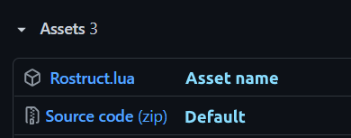

# Basic usage

!!! note
	This page assumes some familiarity with the Promise object. Check out their [extensive documentation](https://eryn.io/roblox-lua-promise/lib/) for more info.

When creating a Rostruct project, you should script with instances in mind. Since your codebase will be turned into Roblox instances, your files will behave as scripts running in Roblox Studio. The following image demonstrates how a Rostruct project is run in Roblox:


The files are transformed into objects, and every Lua script has full functionality. This means your code can require other modules using the `require` function as you would in Roblox Studio.

Your code should access itself and other objects using the `script` global. The following snippet demonstrates requiring some internal dependencies:

```lua
-- File: MidiPlayer/src/Components/Controller.lua
local midiPlayer = script:FindFirstAncestor("MidiPlayer")

local Signal = require(midiPlayer.Util.Signal)
local Date = require(midiPlayer.Util.Date)
local Thread = require(midiPlayer.Util.Thread)
```

To set up a project, locate your executor's `workspace/` directory and create a folder somewhere to host your project. It's recommended to integrate Rojo into your workflow to test your code in Roblox Studio. Rostruct only builds the project files themselves, and no further configuration is needed.

## Rostruct.Build
`Rostruct.Build` is the core of Rostruct; it transforms your project files into Roblox objects, and returns a `BuildResult` object.

```lua
local project = Rostruct.Build("Projects/MidiPlayer/src/")
local midiPlayer = project.Instance
```

If you'd like to rename the project, or modify the instance before scripts are run, you can!
Even if the project is deployed, `LocalScripts` and `ModuleScripts` are all run on deferred threads, allowing you to make your changes before they execute:

```lua
local project = Rostruct.Deploy("Projects/MidiPlayer/src/")
project.Instance.Name = "MidiPlayer"
```

The code above applies to other similar Rostruct functions.

## Rostruct.Deploy
Deploying a project builds it and then executes every `LocalScript` on a deferred thread. It also adds an additional field to the `BuildResult` object: `RuntimeWorker`, a Promise which resolves with every LocalScript in your project after they all finish executing. The code below is an example of how you could use this field:

!!! info
	`RuntimeWorker` will automatically time out after 30 seconds of suspended execution; Avoid making a script take too long to execute!

```lua
local project = Rostruct.Deploy("Projects/Hydroxide/src/")

-- Waits for all scripts to finish executing:
project.RuntimeWorker:andThen(function(scripts)
	print("Amount of scripts executed: " .. #scripts)
	for _, obj in ipairs(scripts) do
		print("Script " .. obj.Name .. " executed!")
	end
end)
```

## Rostruct.Require
Requiring a project builds and deploys it, but adds another additional field: `Module`, a Promise which resolves with exactly what the module returned. The code below is an example of how to require a library:

```lua
local project = Rostruct.Require("Projects/UILibrary/lib/")

-- Gets what UILibrary/lib/init.lua returned:
local UILibrary = project.Module:expect()
UILibrary:create("Frame")
```

## Download a Github release
Rostruct provides functions that allow a user to download and store a release from a Github repository.

The functions `Rostruct.DownloadRelease` and `Rostruct.DownloadLatestRelease` will download the release, with an optional asset target, and return a `DownloadResult` object.

!!! info
	By default, if the target asset is unspecified, Rostruct will download and extract the Source code zip file.
	Assets that are zip files will automatically be extracted. Otherwise, they are downloaded as a single file.
	

The code below demonstrates using `Rostruct.DownloadRelease` on the [declarative UI library, Roact](https://github.com/Roblox/roact/):

```lua
-- Because the 4th parameter, 'asset,' isn't provided,
-- it will download the source code of the release (see info)
local downloadResult = Rostruct.DownloadRelease("Roblox", "roact", "v1.4.0"):expect()
local buildResult = Rostruct.Require(result.Location .. "src/")

local Roact = buildResult.Module:expect()
print(Roact.createElement)
```

You can also download a specific asset. In this example, it will download the `Roact.rbxm` asset from the v1.4.0 release:

```lua
-- Note that Rostruct does not require or execute model files!
-- They still get transformed, so only use them for asset management.
Rostruct.DownloadRelease("Roblox", "roact", "v1.4.0", "Roact.rbxm")
```
