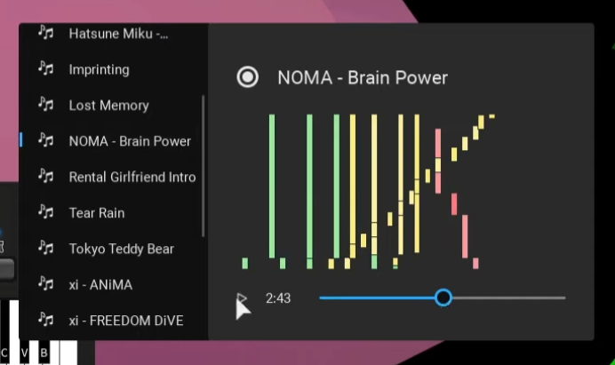

# Scripts using Rostruct

To gain a better understanding of Rostruct, seeing others' implementations may help. Hopefully, there will be more to come, as Rostruct released very recently.

!!! info
	Want your script here? Message 0866#3049 on Discord, or send a PM to 0866 on V3rmillion

## [MidiPlayer](https://github.com/richie0866/MidiPlayer) by 0866

A midi file autoplayer for Roblox piano games. Notable features include:

* Pairs `Rostruct.DownloadLatestRelease` with `Rostruct.Deploy`
* UI stored in a model file
* A single LocalScript initializes the code
* Uses common utility modules

See the [Github repository](https://github.com/richie0866/MidiPlayer) for more information.

